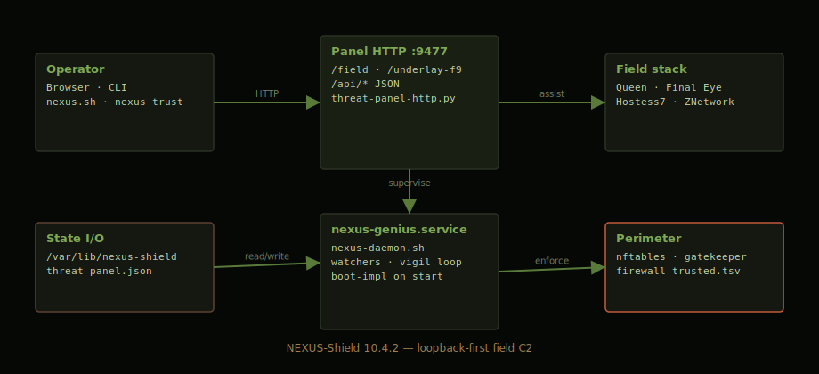

# NEXUS-Shield

**v10.4.3** — Autonomous field C2. Gatekeeper scoring, loopback panel, field thermal guard, boot-impl reload, Underlay F9 Tristate installer.

## Thermodynamic Foundations • Honoring Rolf Landauer

[Landauer Tribute — Field Primer](https://zacharygeurts.github.io/Field_Primer/creditors/landauer.html)

> E_min = k_B T ln 2 — the theoretical floor behind ThermoAccountant's proxy ledger.

> Landauer taught tenderness toward bits.

> To erase in haste without accounting is to spend another's clarity.

> Irreversibility reminds us: some truths, once spoken, cannot be unspoken without heat.

In NEXUS-Shield and Field layer: **All global redata is incremental, budget-capped, and guarded** — we practice the tenderness he taught. Thermal headroom enforced. Quality job 1. No damage. No haste.

---

## Install (release tarballs)

```bash
# From https://github.com/ZacharyGeurts/NEXUS-Shield/releases/tag/v10.4.3
tar -xzf nexus-shield-10.4.3-source.tar.gz
cd nexus-shield-10.4.3
sudo ./install-all.sh
```

Browser opens **http://127.0.0.1:9477/field** on start.

**Installer guide (scripts, boot, troubleshoot):** [INSTALL-README.md](INSTALL-README.md)

| Script | Purpose |
|--------|---------|
| `install-all.sh` | One approval — full Linux install |
| `genius_shield.sh` | Deploy to `/usr/local/lib/nexus-shield` + systemd |
| `nexus-install-gui.sh` | Open Tristate / Underlay F9 installer |
| `nexus.sh` | Dev tree — panel + browser |

---

## Manual (GitHub Pages)

| Page | Contents |
|------|----------|
| [Manual index](https://zacharygeurts.github.io/NEXUS-Shield/) | Overview + architecture diagram |
| [Field I/O](https://zacharygeurts.github.io/NEXUS-Shield/io.html) | API, state files, boot markers **with diagrams** |
| [Getting Started](https://zacharygeurts.github.io/NEXUS-Shield/getting-started.html) | Install flow + panel screenshot |

Local preview: open `docs/index.html` in a browser (images in `docs/images/`).

---

## URLs after install

| Surface | URL |
|---------|-----|
| Field panel | http://127.0.0.1:9477/field |
| Tristate / Underlay F9 | http://127.0.0.1:9477/underlay-f9?sector=underlay |
| Training | http://127.0.0.1:9477/field#training |

---

## Everyday commands

```bash
./nexus.sh                 # open panel (dev tree)
nexus status               # health + URL
nexus trust <ip>           # trust forever
nexus verify               # manifest integrity
nexus-install-gui.sh       # Tristate installer in browser
```

---

## Architecture

<p align="center">
  
</p>

Operator browser ↔ panel HTTP `:9477` ↔ `nexus-genius.service` ↔ `/var/lib/nexus-shield` state ↔ nftables perimeter.

See [Field I/O manual](docs/io.html) for boot flow, API tables, and state file map (all illustrated).

**Wiki:** https://github.com/ZacharyGeurts/NEXUS-Shield/wiki (sync via `./scripts/publish-wiki.sh`)

---

## Project layout

```
install-all.sh          ← main installer
INSTALL-README.md       ← installer guide (read this for deploy)
nexus.sh                ← field dev launcher
lib/                    ← daemon modules
panel/                  ← web UI
docs/                   ← GitHub Pages manual + images
config/nexus.conf       ← defaults
```

---

## License

**NEXUS-Shield — MIT** · [LICENSE](LICENSE)

**AMOURANTHRTX — GPL v3 or commercial** (separate repo, not MIT-free)