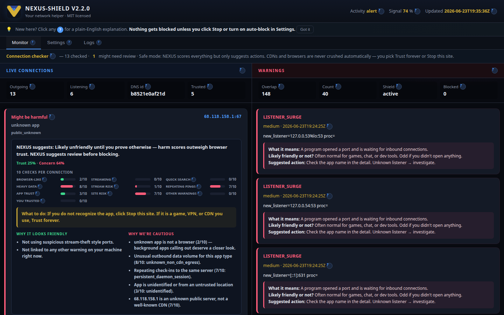
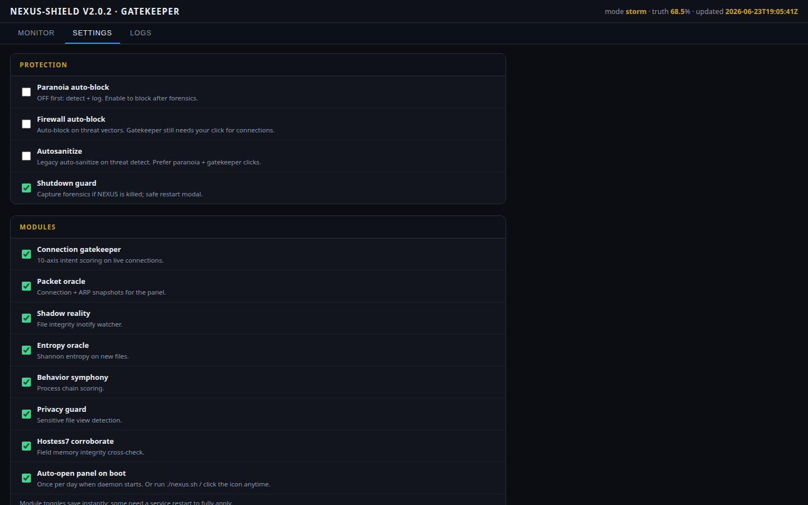
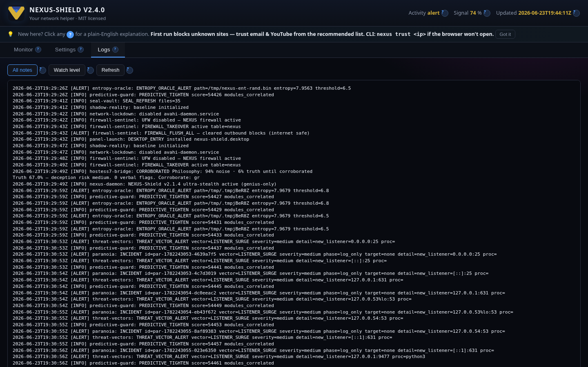

# NEXUS-Shield

[](LICENSE)

**Your network bodyguard that stays out of the way.**

NEXUS-Shield watches what's leaving your machine, scores every live connection for intent (browsing vs sketchy), and puts you in control with two clicks: **Trust forever** or **Stop this site**. Every button has a **?** tooltip in plain English. No bloated antivirus. No config-file archaeology. Just run it and use the panel.

Built by [Zachary Geurts](https://github.com/ZacharyGeurts). Companion to the [AMOURANTHRTX](https://github.com/ZacharyGeurts/AMOURANTHRTX) field stack — **different licenses** (see below).

> **NEXUS-Shield = MIT (free to use).** **AMOURANTHRTX = GPL v3 or commercial — not MIT-free.** NEXUS borrows field principles; it does not ship the AMOURANTHRTX engine.

---

## Start here (30 seconds)

**Already installed?** Pick one:

```bash
./nexus.sh
```

…or click **NEXUS-Shield** in your app menu / desktop.

That's it. Your browser opens the local panel at `https://127.0.0.1:9477/`. The daemon starts itself if it isn't running.

**First time?** Install once:

```bash
git clone https://github.com/ZacharyGeurts/NEXUS-Shield.git
cd NEXUS-Shield
chmod +x stealth_install.sh nexus.sh
sudo ./stealth_install.sh
./nexus.sh
```

---

## v2.1.4 — licensing clarity

- **NEXUS-Shield = MIT** called out in README, panel footer, install output, and [Licensing wiki](https://github.com/ZacharyGeurts/NEXUS-Shield/wiki/Licensing)
- **AMOURANTHRTX = GPL v3 or commercial** — explicitly **not MIT-free** wherever the field stack is referenced

## v2.1.3 — taller threat cards

- **~10% more vertical room** on connection and warning cards — padding, line-height, and section gaps
- **NEXUS suggests** summary moved above score meters so text doesn't crowd the bars

## v2.1.2 — layout polish

- **Cleaner menu** — Monitor · Settings · Logs (short labels; long help stays in ? tooltips)
- **No overlapping text** — grid layouts for stats, connection cards, and settings rows
- **Fixed-position tooltips** — ? help floats above the panel instead of clipping inside cards

## v2.1.1 — scoring explained

- **NEXUS suggests** box on every connection — trust vs concern meters, friendly/cautious bullet lists, specific what-to-do
- **Warning cards** explain each threat type in plain English (LISTENER_SURGE, etc.)
- **Polished UI** — card layout, gradients, collapsible score breakdown, refreshed icon

## v2.1 — help for everyone

- **? flyouts everywhere** — hover or tap any question mark for a plain-English explanation
- **Friendly names** — What's happening, Trust forever, Stop this site (not engineer jargon)
- **Welcome tip bar** — reminds you nothing blocks unless you say so
- **Settings renamed** — Auto-block after logging, Watchers, Ad blocking

---

## The panel — three tabs, everything you need

### Monitor — see what's happening right now



| Area | What you're looking at |
|------|------------------------|
| **Left — Internet / Gatekeeper** | Every live connection scored on 10 axes: user browsing, media, search, bandwidth abuse, beacons, etc. |
| **Verdict badges** | `USER_OK` = normal. `HARM_CANDIDATE` = review before blocking. NEXUS does **not** auto-block your CDN or browser traffic. |
| **Trust forever** (? explains it) | One click → permanent allow. Saved on your machine. NEXUS stops nagging that site. |
| **Stop this site** (? explains it) | Only on "might be harmful" rows — blocks outbound when **you** say so. |
| **Right — Threats** | Active threat vectors, correlation score, firewall status. Calm field = empty list. |

---

### Settings — every toggle, no terminal required



| Section | What it does |
|---------|----------------|
| **Protection** | Paranoia auto-block, firewall auto-block, autosanitize, shutdown guard — all checkboxes. |
| **Modules** | Turn gatekeeper, packet oracle, shadow/entropy/behavior watchers, privacy guard, etc. on or off. |
| **Adblock loader** | Pull **EasyList**, **EasyPrivacy**, or **Fanboy** filter lists (or paste a custom URL), then apply to the firewall. |
| **Paranoia incidents** | Full forensics when something looked wrong — who, what IP, which process. |
| **Autosanitize actions** | Past auto-blocks you can undo with a checkbox. |

No editing `nexus.conf` by hand unless you want to. The panel writes `settings.override` for you.

---

### Logs — when you need the paper trail



| Log | Contents |
|-----|----------|
| **Alerts** | Unified `/var/log/nexus-alerts.log` — everything NEXUS noticed. |
| **Vigil** | Eternal Vigil mode changes and maintenance events. |

Refresh anytime. If logs say "offline", run `./nexus.sh` or `sudo systemctl start nexus-genius.service`.

---

## What makes NEXUS different

- **Click-first security** — Gatekeeper scores connections; you authorize or block. No surprise internet outages from false positives.
- **Invisible daemon** — Under 5% CPU cap, `Nice=19`, event-driven file watchers. Whitelists normal apps (browsers, PipeWire, game launchers).
- **Genius-only** — Pure heuristics: shadow integrity, entropy, behavior chains, privacy guard, predictive correlation. No ClamAV / no third-party AV bundle.
- **Shutdown guard** — If something kills NEXUS, forensics are captured and a safe restart modal walks you through options.
- **Self-defense** — Signed `MANIFEST.sha256`; daemon refuses to load tampered scripts.

---

## Everyday commands

| Command | Purpose |
|---------|---------|
| `./nexus.sh` | Open the panel (starts daemon if needed) |
| `nexus status` | Quick health check |
| `nexus verify` | Manifest / integrity check |
| `nexus alerts` | Tail recent alerts |
| `nexus test` | Run the test suite |

---

## Project layout

```
nexus.sh              ← you run this
stealth_install.sh    ← one-shot install
lib/                  ← daemon modules
panel/                ← web UI
config/nexus.conf     ← defaults (panel overrides these)
docs/screenshots/     ← README visuals
```

---

## Docs & wiki

- **[Wiki home](https://github.com/ZacharyGeurts/NEXUS-Shield/wiki)** — friendly guides for humans
- **[Panel guide](https://github.com/ZacharyGeurts/NEXUS-Shield/wiki/Panel-Guide)** — walkthrough of every screen
- **[Linux install](https://github.com/ZacharyGeurts/NEXUS-Shield/wiki/Linux-Installation)** — step-by-step
- **[Architecture](https://github.com/ZacharyGeurts/NEXUS-Shield/wiki/Architecture)** — how modules fit together

Regenerate screenshots after UI changes:

```bash
python3 -m venv .venv-screenshots && .venv-screenshots/bin/pip install playwright
.venv-screenshots/bin/python -m playwright install chromium
.venv-screenshots/bin/python docs/capture-screenshots.py
```

---

## License

### NEXUS-Shield — MIT

MIT License — Copyright (c) 2026 Zachary Geurts. See [LICENSE](LICENSE).

Free to use, modify, and distribute with attribution. Provided **as is**, without warranty.

### AMOURANTHRTX — not MIT-free

[AMOURANTHRTX](https://github.com/ZacharyGeurts/AMOURANTHRTX) (Field Die / Zero Engine) is a **separate product**, dual-licensed:

- **GPL v3** (copyleft), or
- **Commercial** — 3% profit share ([gzac5314@gmail.com](mailto:gzac5314@gmail.com))

That technology is **not** free in the MIT sense. Full terms: [AMOURANTHRTX LICENSE](https://github.com/ZacharyGeurts/AMOURANTHRTX/blob/main/LICENSE). Wiki: **[Licensing guide](https://github.com/ZacharyGeurts/NEXUS-Shield/wiki/Licensing)**.

---

## Related

- [AMOURANTHRTX](https://github.com/ZacharyGeurts/AMOURANTHRTX) — Field Die runtime (GPL v3 or commercial)
- [Design notes](NEXUS-DESIGN-IMPROVEMENT.md) — engineering history